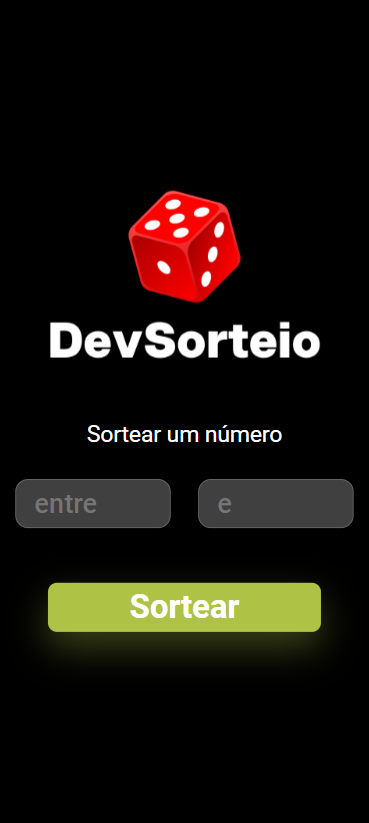

<h1>Projeto Dev Sorteio</h1>

Esse foi um projeto JavaScript que visa usar na prática a funcionalidade Math.random() do JS, que gera números aleatórios

<h3>Tecnologias Utilizadas:</h3>
<ul>
  <li>HTML</li>
  <li>CSS</li>
  <li>Javascript</li>
</ul>

<h4>Desktop:

<h4>Mobile:</h4>

